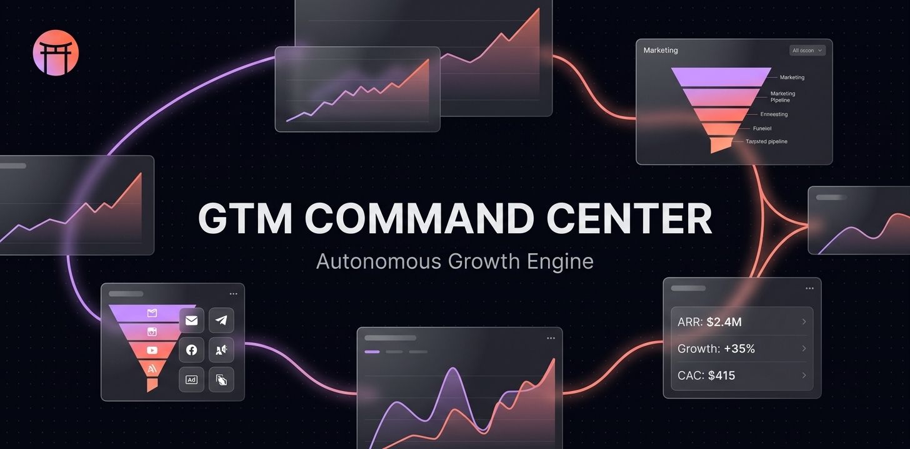

<p align="center">
  
</p>

<h1 align="center">GTM Engineering Command Center</h1>

<p align="center">
  <strong>The autonomous growth operating system for Claude Code.</strong><br>
  Multichannel orchestration. AARRR funnel diagnostics. Self-learning loops.<br>
  One north star: <em>print cash.</em>
</p>

<p align="center">
  <a href="#installation"></a>
  
  
  
</p>

<p align="center">
  <a href="#slash-commands">20 Commands</a> •
  <a href="#agents">13 Agents</a> •
  <a href="#skills">14 Skills</a> •
  <a href="#routines">4 Cloud Routines</a> •
  <a href="#knowledge-base">130+ Tactics</a>
</p>

---

## What Is This?

The GTM Engineering Command Center transforms Claude Code into a **full-stack autonomous growth engine**. It doesn't just run ads — it owns the entire revenue lifecycle:

```
        ┌─────────────────────────────────────────────────────┐
        │              AARRR FUNNEL OWNERSHIP                 │
        │                                                     │
        │  Acquisition ──→ Activation ──→ Retention           │
        │  (Ads, SEO,      (Onboarding,   (Email drips,      │
        │   Content,        Landing pages,  Engagement         │
        │   Outreach)       Emails)         loops)             │
        │                                                     │
        │  Revenue ──→ Referral                               │
        │  (Pricing,    (Viral loops,                         │
        │   Upsells,     Ambassador                           │
        │   Checkout)    programs)                             │
        └─────────────────────────────────────────────────────┘
                              │
                    ┌─────────┴─────────┐
                    │  DIAGNOSE → FIX   │
                    │  Where is revenue  │
                    │  leaking? Fix it.  │
                    └───────────────────┘
```

**It detects your stack.** Scans your codebase for Resend, PostHog, Stripe, Tailwind, Supabase, Vercel — whatever you use — and adapts.

**It diagnoses bottlenecks.** Correlates data across PostHog sessions, Stripe revenue, Meta/Google ad metrics, and email performance to find exactly WHERE your funnel is broken.

**It fixes them.** Generates landing pages using your design system, creates email drip campaigns matching your template style, deploys ad campaigns via API, writes SEO content, and builds referral programs.

**It verifies its own work.** Uses Playwright, Computer Use, and Chrome DevTools to QA every deployment — pixel fires, mobile responsiveness, funnel walkthroughs.

**It never sleeps.** Cloud Routines pull metrics daily, optimize weekly, and check every PR for conversion tracking completeness.

---

## The Loop

Every GTM session runs this loop. The `/gtm` command orchestrates all 7 phases:

```
  ┌──────────────────────────────────────────────────────────────┐
  │                                                              │
  │   Phase 1        Phase 2          Phase 3        Phase 4     │
  │  ┌─────────┐   ┌──────────┐    ┌──────────┐   ┌──────────┐  │
  │  │ DIAGNOSE│──→│ CHANNEL  │──→ │  PLAN    │──→│ CREATE   │  │
  │  │ funnel  │   │ STRATEGY │    │ per      │   │ assets   │  │
  │  │ health  │   │ Meta?    │    │ channel  │   │ ads,     │  │
  │  │ score   │   │ Google?  │    │ budgets  │   │ emails,  │  │
  │  │ each    │   │ Email?   │    │ targets  │   │ pages,   │  │
  │  │ stage   │   │ SEO?     │    │ copy     │   │ content  │  │
  │  └─────────┘   └──────────┘    └──────────┘   └──────────┘  │
  │                                                              │
  │   Phase 5        Phase 6          Phase 7                    │
  │  ┌──────────┐   ┌──────────┐    ┌──────────┐                │
  │  │ DEPLOY   │──→│ MEASURE  │──→ │ LEARN    │────────┐       │
  │  │ Meta API │   │ PostHog  │    │ save     │        │       │
  │  │ Google   │   │ Stripe   │    │ insights │        │       │
  │  │ Email    │   │ Meta     │    │ update   │        │       │
  │  │ Git      │   │ Google   │    │ memory   │        │       │
  │  │ (PAUSED) │   │ Email    │    │ register │        │       │
  │  └──────────┘   └──────────┘    │ tests    │        │       │
  │                                 └──────────┘        │       │
  │                                                     │       │
  │  ◄──────────────────────────────────────────────────┘       │
  │   (learnings feed back into next cycle)                     │
  └──────────────────────────────────────────────────────────────┘
```

Human approves strategy. Agent executes everything.

---

## Installation

```bash
# Add the marketplace
claude plugins marketplace add DojoCodingLabs/GTM-Engineering-Command-Center

# Install the plugin
claude plugins install gtm-engineering-command-center

# Reload
/reload-plugins
```

Then in your project:

```
/gtm-setup
```

This auto-detects your stack (email provider, analytics, payments, design system, deployment platform) and creates the `.gtm/` directory with your configuration.

---

## Slash Commands

### Core Loop

| Command | What It Does |
|---------|-------------|
| `/gtm` | **Full lifecycle orchestrator** — runs all 7 phases: Diagnose → Channel Strategy → Plan → Create → Deploy → Measure → Learn |
| `/gtm-setup` | First-run wizard — detects 20+ integrations, maps AARRR funnel, creates `.gtm/` config |
| `/gtm-diagnose` | Find the single biggest revenue bottleneck across your entire funnel |
| `/gtm-funnel` | Map your AARRR funnel with health scores (0-100) per stage |

### Channel Commands

| Command | What It Does |
|---------|-------------|
| `/gtm-plan` | Multichannel media planning — Meta, Google, Email, SEO, Outreach |
| `/gtm-create` | Generate assets — ad creatives (Nano Banana 2), email templates, landing pages, SEO content |
| `/gtm-deploy` | Deploy to any channel — Meta Graph API, Google Ads API, email provider, git commit |
| `/gtm-metrics` | Unified metrics from all channels — Meta + Google + PostHog + Stripe + Email |
| `/gtm-report` | Weekly performance report with cross-channel attribution |
| `/gtm-learn` | Extract insights, save learnings, update strategies |

### Specialist Commands

| Command | What It Does |
|---------|-------------|
| `/gtm-email` | Create and deploy email drip campaigns using your project's design system |
| `/gtm-seo` | Technical SEO audit + GEO optimization + content generation |
| `/gtm-landing` | Generate conversion-optimized landing pages using your component library |
| `/gtm-outreach` | Signal-based cold outreach sequences (Tier 1-2 ethical tactics only) |
| `/gtm-referral` | Design and implement a referral program with K-factor projections |
| `/gtm-experiment` | Structured A/B experiment tracking with statistical significance checks |
| `/gtm-qa` | Autonomous QA — pixel verification, funnel walkthroughs, mobile testing, performance audits |

### Utility Commands

| Command | What It Does |
|---------|-------------|
| `/gtm-scrape` | Scrape Reddit, X, GitHub for the latest GTM strategies and hacks |
| `/gtm-animate` | Create animated video ads with Remotion |
| `/gtm-routines` | Manage autonomous cloud routines (daily metrics, weekly optimization, PR checks) |

---

## Agents

13 specialized agents, each an expert in their domain. No model pinning — every agent runs on the most capable model available in your environment.

| Agent | Role |
|-------|------|
| **funnel-diagnostician** | Cross-channel bottleneck inference engine. Correlates PostHog + Stripe + Meta + Email data to find WHERE revenue leaks. |
| **media-buyer** | Plans Meta + Google Ads campaigns with cross-channel budget allocation. Signal-based audience targeting. |
| **creative-director** | Generates ad creatives via Nano Banana 2. DS-anchored prompts, 1:1 + 9:16 formats, 5x copy variations. |
| **campaign-operator** | Deploys campaigns via Meta Graph API, Google Ads API, and email provider APIs. Multichannel routing. |
| **data-analyst** | Unified metrics across all channels. Stripe MRR/LTV, email open rates, SEO rankings, ad performance. Cross-channel attribution. |
| **email-marketer** | Designs drip sequences and generates email templates matching your project's existing design system. |
| **seo-engineer** | Technical SEO audit, GEO optimization, programmatic content generation, schema markup. |
| **landing-page-builder** | Generates landing page components using your project's actual UI library and Tailwind config. Outputs production code. |
| **outreach-operator** | Signal-based cold outreach. Monitors buying signals, generates personalized sequences. Ethical Tier 1-2 only. |
| **referral-architect** | Designs referral programs. Calculates K-factor, generates DB schema + API + UI + email implementation. |
| **stack-detector** | Deep project stack discovery. Scans 20+ integration types and maps them to GTM capabilities. |
| **growth-hacker** | Community intelligence. Scrapes Reddit, X, GitHub for strategies. Compares findings against the GTM Atlas. |
| **qa-engineer** | Autonomous QA via Playwright, Computer Use, Chrome DevTools. Verifies every deployment before declaring success. |

---

## Skills

14 domain knowledge stacks that agents reference for deep expertise.

| Skill | Domain |
|-------|--------|
| `meta-ads` | Meta Ads API — Advantage+ Creative, asset_feed_spec, pixel/CAPI, Graph API patterns |
| `google-ads` | Google Ads — Search, Performance Max, Display, keyword strategy, Smart Bidding |
| `email-marketing` | Drip sequences, deliverability (SPF/DKIM/DMARC), template patterns, provider APIs |
| `seo-engineering` | Technical SEO, content strategy, schema markup, GEO optimization |
| `landing-page-patterns` | Hero patterns, social proof, CTA optimization, design system integration |
| `irresistible-offer` | Direct response copywriting — Hormozi offers, PAS, AIDA, variation generation |
| `campaign-optimization` | Budget allocation, creative testing, scaling playbook, statistical significance |
| `posthog-analytics` | PostHog REST API, HogQL, funnel analysis, cohort creation, dashboard templates |
| `funnel-diagnostics` | AARRR bottleneck patterns, correlation rules, cross-channel inference engine |
| `stack-detection` | Provider fingerprints (20+ integrations), framework detection, capability mapping |
| `cross-channel-logic` | Channel sequencing templates, attribution models, retargeting chains |
| `stripe-revenue` | MRR tracking, cohort revenue analysis, LTV calculation, payback period |
| `browser-qa` | Playwright patterns, Computer Use patterns, QA verification checklists |
| `gtm-atlas` | Full GTM Creativity Atlas 2026 — 130+ tactics, ethical ratings, tool directory |

---

## Knowledge Base

The plugin ships with two comprehensive knowledge bases:

### GTM Creativity Atlas 2026
1,557 lines. 130+ documented tactics. 15 sections covering every GTM strategy from PLG to AI SDR platforms. Includes:
- Signal hierarchy for intent-based selling
- 5-tier ethical framework (score 1-10 for every tactic)
- Complete tools directory with pricing
- Case studies: Dropbox, Calendly, Clay, Loom, Notion, and more

### AARRR Framework Reference
Industry benchmarks by vertical (developer tools, B2B SaaS, consumer, marketplace). Funnel health scoring algorithm. Cross-stage correlation patterns with diagnostic prescriptions.

---

## Routines

Cloud-based autonomous workflows powered by [Claude Code Routines](https://code.claude.com/docs/en/routines). They run on Anthropic's infrastructure — no laptop required.

| Routine | Trigger | What It Does |
|---------|---------|-------------|
| **Daily Metrics Pull** | Scheduled, 9 AM daily | Pulls all channel metrics, saves snapshot, alerts on threshold breaches |
| **Weekly Optimization** | Scheduled, Monday 10 AM | Full learning loop + funnel diagnosis + weekly report |
| **PR Conversion Check** | GitHub PR event | Reviews landing page / email PRs for conversion tracking completeness |
| **Experiment Monitor** | Scheduled, 6 PM daily | Checks active A/B experiments for statistical significance |

Set up via `/gtm-routines` or `claude routines create`.

---

## Stack Detection

`/gtm-setup` auto-detects your entire tech stack:

```
GTM Stack Detection Complete

| Category       | Detected          | Details                                    |
|----------------|-------------------|--------------------------------------------|
| Framework      | Vite + React      | TypeScript, Tailwind CSS                   |
| Email          | Resend            | 16 templates, drip scheduler, React Email  |
| Analytics      | PostHog + GA4     | 100+ events, consent management            |
| Pixel/CAPI     | Meta Pixel + CAPI | 8 standard events, deduplication active    |
| Payments       | Stripe            | 3 tiers: Free / Pro $47 / VIP $297        |
| Design System  | Tailwind + Custom | 130+ components, glassmorphism system      |
| Deployment     | Vercel            | Edge Functions, serverless                 |
| SEO            | Custom seoService | 50+ methods, 10 schema types, sitemap      |
| Onboarding     | Multi-step wizard | Persona selection, 5 steps                 |
| Auth           | Supabase Auth     | Email + social OAuth                       |
| Referral       | Org invites only  | No public referral program (GAP!)          |

AARRR Funnel Health:
  Acquisition:  ████████░░ 80  [STRONG]
  Activation:   ███████░░░ 70  [STRONG]
  Retention:    █████░░░░░ 50  [MODERATE]
  Revenue:      ████████░░ 80  [STRONG]
  Referral:     ██░░░░░░░░ 20  [WEAK] ← biggest gap

Recommended: /gtm-referral to design a public referral program
```

---

## Diagnostic Engine

The funnel diagnostician correlates data across ALL your tools to find revenue bottlenecks:

```
/gtm-diagnose

Diagnosis: Activation → Revenue gap
Evidence:
  - Activation rate: 45% (above benchmark)
  - Trial-to-paid conversion: 3.2% (below 5% benchmark)
  - Pricing page visits: 890/month
  - Pricing page → checkout: 2.1% (below 5% benchmark)

Root cause: Users value the product but resist payment.
  - PostHog shows 68% of trial users use 3+ features
  - But only 3.2% convert to paid (industry avg: 5-8%)

Prescription:
  1. /gtm-experiment — Test reverse trial (full access → auto-downgrade)
     Expected impact: +2-4% conversion = +$X MRR
  2. /gtm-email — Create pricing page abandonment sequence
     Expected impact: recover 10-15% of pricing page visitors
  3. /gtm-landing — Create comparison page vs competitors
     Expected impact: capture high-intent search traffic
```

---

## Project Structure

After `/gtm-setup`, your project contains:

```
your-project/
└── .gtm/
    ├── config.json          # API credentials (gitignored)
    ├── MEMORY.md            # Accumulated learnings index
    ├── .gitignore           # Protects secrets
    ├── campaigns/           # Campaign deployment records
    ├── creatives/           # Generated ad creatives
    ├── emails/              # Email template outputs
    ├── experiments/         # A/B experiment tracking
    ├── funnel/              # AARRR funnel snapshots
    ├── landing-pages/       # Landing page specs
    ├── learnings/           # Historical insights
    ├── metrics/             # Performance snapshots
    ├── plans/               # Media plans
    ├── qa/                  # QA reports and screenshots
    ├── seo/                 # SEO audits and content plans
    └── strategies/          # Community intelligence
```

---

## How the Self-Learning Loop Works

```
Session 1: Campaign performs poorly (CPA $8, target $3)
  → /gtm-learn extracts: "Broad targeting in MX wastes budget"
  → Saved to .gtm/learnings/targeting-insights.md

Session 2: /gtm-plan reads learnings FIRST
  → Automatically narrows targeting based on past failure
  → CPA drops to $2.50

Session 3: /gtm-diagnose finds activation bottleneck
  → /gtm-email creates activation drip sequence
  → Activation rate improves 12% → 24%

Session 4: /gtm-learn correlates email + ad data
  → "Users from Google Ads have 2x higher LTV than Meta"
  → Budget reallocation: shift 30% from Meta to Google

Every session makes the next one smarter.
```

---

## Requirements

| Requirement | Details |
|---|---|
| **Claude Code** | Latest version with plugin support |
| **Meta Ads** | Optional — Ad Account + System User token from live-mode Business app |
| **Google Ads** | Optional — Customer ID + developer token |
| **PostHog** | Optional — Project API key + Personal API key for reading metrics |
| **Stripe** | Optional — Publishable key (plugin reads revenue data from API) |
| **Gemini API** | Optional — For Nano Banana 2 ad creative generation |
| **Email Provider** | Optional — Resend, SendGrid, or Postmark API key |

The plugin works with whatever you have configured. No channel is required — it adapts to your stack.

---

## Philosophy

> *A single GTM Engineer with the right agentic stack in 2026 can outperform a 10-person traditional sales and marketing team.*
>
> — GTM Creativity Atlas 2026

This plugin is that stack. It's not a tool — it's an autonomous growth team:

- **Media Buyer** who plans and deploys across Meta + Google
- **Creative Director** who generates on-brand assets with AI
- **Data Analyst** who correlates metrics across every channel
- **Growth Hacker** who scrapes the internet for new strategies
- **Email Marketer** who builds drip campaigns matching your design system
- **SEO Engineer** who audits and generates content for organic growth
- **Landing Page Builder** who writes production code using your components
- **QA Engineer** who verifies everything works in a real browser
- **Funnel Diagnostician** who finds exactly where money is leaking

Human approves. Agent executes. Revenue grows.

---

## Contributing

PRs welcome. This is open source under MIT.

```bash
git clone https://github.com/DojoCodingLabs/GTM-Engineering-Command-Center.git
```

---

## License

MIT — see [LICENSE](./LICENSE).

<p align="center">
  Built by <a href="https://dojocoding.com">Dojo Coding Labs</a> 🏯
</p>
