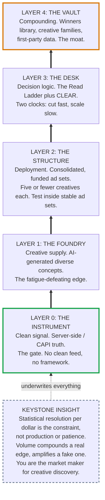
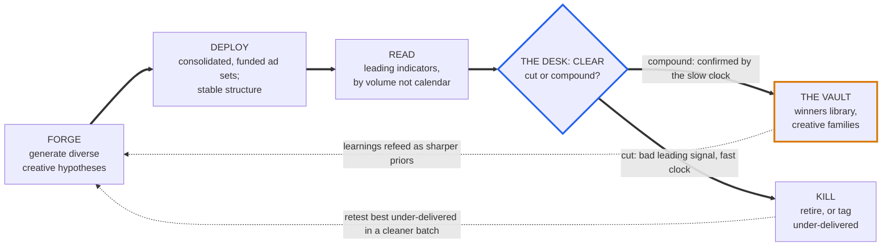

# High-Velocity Advertising (HVA)

**A framework for creative discovery at machine speed.**

HVA is a system for generating, deploying, reading, and retiring creative hypotheses faster than competitors **without destroying signal quality**, by treating the platform's learning phase as a real-time market maker for creative discovery.

It belongs to the same family as **PIBER** (strategic narrative) and **IDCF** (product strategy): a named, mnemonic, teachable discipline. PIBER governs the story. IDCF governs the product. **HVA governs the spend.**

This skill is the spec. The discrete rules below become testable conditions in the commands (`/hva`, `/hva-forge`, `/hva-lint`, `/hva-review`, `/hva-vault`) and the `hva-desk` agent, and the deterministic checks in `scripts/hva-score.py`.

> **In this plugin, HVA is an engine, not a replacement.** It runs parallel to the slow-craft `/gtm` lifecycle. One company can run both. Match the engine to the conversion, not to the excitement (see `rules/guardrails.md` → Fit Boundary).

---

## Keystone Insight

The constraint was never creative production or the patience the learning phase demands. It is **statistical resolution per dollar.** The edge belongs to whoever reads a true leading signal on clean data faster than the crowd, because volume collapses variance only around a *real* edge and amplifies it around a *false* one.

You are not the latency arbitrageur trying to outrun the exchange. You are the **market maker**: you quote continuously, you give the algorithm the creative liquidity it needs, and you harvest the spread of discovery. You provide the options; the algorithm provides the reach; you read its first moves before the rest of the table looks up. The structure stays stable enough for it to keep learning.

**Volume compounds a real edge and amplifies a fake one.** That asymmetry is why CLEAR exists.

---

## CLEAR — the decision rule

Five letters, the heart of HVA the way P-I-B-E-R is the heart of a case board. Each is a testable condition; see `rules/the-desk.md` for thresholds and `scripts/hva-score.py` for the implementation.

| Letter | Rule | One line |
|---|---|---|
| **C**lean | Trade only on server-side truth (CAPI, not platform-reported numbers alone). | No clean feed, no decision. |
| **L**ead | Judge on leading indicators (frequency behavior, the three relevance rankings, cost per micro-conversion), never first-window ROAS. | Read the algorithm's first moves, not the scoreboard. |
| **E**conomics | Kill at roughly **3× target CPA** spent with zero qualifying event. Thresholds are spend-relative to your CAC, never a borrowed impression count. | Bounded cost of being wrong. |
| **A**symmetry | Cut fast on a single bad leading signal; scale slow, only after the true-conversion clock confirms. | Two clocks, deliberately mismatched. |
| **R**eplication | A lone winner among many simultaneous tests is probably a multiple-comparisons ghost. Confirm with a correction (Benjamini-Hochberg) or a clean repeat before betting budget. | Don't crown a coin flip. |

---

## The Stack — five layers

Read bottom-up. Each layer exists only to serve the keystone; remove one and the layer above it is trading on a lie. The **keystone** is bedrock, **Layer 0 is the gate**, **Layer 4 is the moat**.

| Layer | Name | What it is | In this plugin |
|---|---|---|---|
| **0** | **The Instrument** | Clean signal — server-side / CAPI truth feeding everything. The gate, not a feature. The platform undercounts real conversions by default, so a dirty feed makes you fast and wrong. | `skills/meta-ads/rules/pixel-setup.md`, EMQ 8+ rules in `skills/campaign-optimization/SKILL.md`, CAPI fields in `agents/data-analyst.md` |
| **1** | **The Foundry** | Creative supply. AI generation producing genuinely distinct concepts (angle, hook, promise, proof, format), not variations of one idea. The durable edge: an inexhaustible supply that outruns fatigue. | `/hva-forge` → `agents/creative-director.md` + `skills/neuro-testing/`. See `rules/the-foundry.md` |
| **2** | **The Structure** | Deployment. Consolidated, adequately funded ad sets; five or fewer creatives each; Advantage+ / CBO allocating. Fund each concept enough to reach decision volume in hours. | `skills/meta-ads/rules/campaign-structure.md` + `agents/campaign-operator.md`. **HVA shape:** one concept per ad, ≤5 ads in one funded ad set — so `insights get --ad-id` reads a single creative |
| **3** | **The Desk** | Decision logic. Runs the Read Ladder and CLEAR. Converts the algorithm's early behavior into cut-or-scale calls at machine speed. | `agents/hva-desk.md` + `scripts/hva-score.py`. See `rules/the-desk.md` |
| **4** | **The Vault** | Compounding. Winners library, systematic fatigue rotation, creative families bred from confirmed winners, and the flywheel of proprietary judgment plus first-party data. **This is the moat.** | `/hva-vault` → `.gtm/hva/vault/`. See `rules/the-vault.md` |

The signals commoditize; the system and the data do not. Push the defensibility into the Vault by design.

---

## The Loop

Forge, Deploy, Read, Decide (cut or compound), Refeed. Continuous. Every cycle's learnings re-enter the Foundry as sharper generation priors, so the supply gets smarter, not only faster.

The Desk (blue) is the only decision point, and it runs CLEAR on every creative. Two exits, two clocks: a **fast** cut on any bad leading signal, and a **slow** promote that waits for the true-conversion clock before sending a winner to the Vault. Both exits loop back to the Foundry.

**Three callers, one Desk.** The loop is driven by three interchangeable read mechanisms — the on-demand `/hva-review` command, the hourly `routines/hva-read-loop.md` cloud routine, and the `scripts/hva-watch.sh` local watch loop. All three invoke the *same* Desk → the *same* `scripts/hva-score.py` → the *same* autonomy gate, so safety behaves identically regardless of cadence.

---

## Autonomy modes

The Desk's authority is configured per-account in `.gtm/config.json` → `hva.autonomy`. Default is the safest. See `agents/hva-desk.md` for enforcement.

| Mode | Pauses (cut) | Budget increase (scale) | Use when |
|---|---|---|---|
| `recommend` *(default)* | Recommends only — human approves | Recommends only — human approves | Building trust; matches the plugin's PAUSED-by-default culture |
| `cut-auto` | **Auto-pauses** losers (saves money, fully reversible) | Recommends only — human approves | You trust the cut logic but not unattended spend |
| `full-auto` | Auto-pauses losers | Auto-scales winners, bounded by `scale_bid_cap_multiple` (0.7×) and `max_daily_budget_increase_pct` (20%/day) | Mature account, audited loop, real machine speed |

Pausing only ever *saves* money and is reversible, so it is the safe direction to automate first. Raising budget *spends* money, so it stays gated longer. This mirrors CLEAR's **A**symmetry directly.

---

## The Fit Boundary

HVA is a tool with a domain, not a universal law.

- **Run HVA where it wins:** fast, cheap, well-tracked conversions. DTC, apps, info products, low-friction lead gen, fast purchase cycles, strong creative variation, and budget large enough to hit volume thresholds in hours.
- **Do not run HVA where it loses:** high-ticket B2B, long sales cycles, tiny audiences, weak tracking, low-budget accounts, regulated categories, delayed or offline conversion.

For the second list, run the **opposite motion** — the slow-craft `/gtm` lifecycle: a small number of high-craft concepts, reads measured in weeks not hours, lead quality scored by sales rather than lead cost scored by the platform, and the feedback loop running through closed-won data in the CRM. The HVA Phase-0 fit check **warns and routes** to `/gtm` when the account doesn't fit; the cloud routine can hard-block. Scoring rubric: `rules/guardrails.md`.

---

## Naming discipline

The framework is **High-Velocity Advertising (HVA).** Do **not** call it High-Frequency Advertising: in the platform, *frequency* already names how often one person sees an ad, and the collision will confuse the operators you teach.

---

## Rule files

| File | Contents |
|---|---|
| `rules/the-desk.md` | CLEAR checks in full, the Read Ladder (1–2k / 2–5k / 5k+ impressions), the Diagnostic Table, the two-clocks asymmetry. **The contract `scripts/hva-score.py` implements and is tested against.** |
| `rules/the-foundry.md` | Diverse-concept taxonomy and variety-over-duplication; how `/hva-forge` reuses `creative-director` + neuro pre-testing. |
| `rules/the-vault.md` | Winners-library schema, creative families, cross-campaign priors, fatigue rotation, the multiple-comparisons philosophy. |
| `rules/guardrails.md` | The failure modes HVA exists to kill → the `/hva-lint` checklist; the Fit Boundary scoring rubric. |
| `rules/evidence-base.md` | The receipts: learning phase, signal loss, creative count, divergent delivery, multiple comparisons. |

## Close

Most operators still think in calendar time. They wait, they watch, they let the machine work over days. HVA is the refusal of that wait — not by outrunning the algorithm, but by feeding it more honest options than anyone else can, and reading its first moves before the rest of the table looks up. **Speed is not the edge. A real edge, executed at speed, is the edge.** The market maker does not predict the next tick. He is simply already there when it prints.
